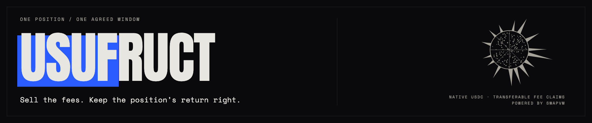

# usufruct



**Sell one window of a Uniswap position’s USDC fees upfront. Keep the right to recover the same position.**

[Live app](https://usufruct-mu.vercel.app) · [Project brief](PROJECT_BRIEF.md) · [Quickstart](docs/QUICKSTART.md) · [Architecture](docs/ARCHITECTURE.md) · [Demo walkthrough](docs/TEAMMATE_BRIEF.md) · [Docs](docs/README.md)

## Problem first

An LP may want cash today without selling their position permanently. A buyer may want exposure to its fee income without owning its principal. Separating those rights also creates a timing problem: if fees are collected late, which income belongs to the agreed window?

usufruct turns one fixed earning window into transferable claims and settles its endpoint from authenticated historical state. The original NFT stays intact; its return right and the fee claims remain separate.

## How it works

1. **Pin a seed.** The NFT owner signs an exact listing: the share offered, USDC price, earning endpoint and acceptance deadline. Publication moves neither the NFT nor money.
2. **Fund, then accept.** A buyer funds a refundable offer. The seller separately approves and accepts it, receiving USDC and placing the original NFT in escrow with its liquidity and range fixed.
3. **Trade the window.** ERC-20 claims carry their share of the whole period’s unpaid native USDC income, including income earned before a transfer. Aqua/SwapVM quotes support purchases, resale and maker cancellation when executable liquidity exists.
4. **Capture and recover.** Fees can be collected after the endpoint. The residual owner can recover the same NFT after capture, even while allocation awaits proof.
5. **Verify and redeem.** The contract authenticates the exact endpoint, reserves the sold-period USDC, and pays claimholders independently against the original claim supply.

**One window, not monthly strips.** Other-currency fees are not converted to USDC. Income may be zero; resale and proof availability are not guaranteed. Early closure requires all original claims plus the residual right.

## Built with

| Integration | What it does | Implementation |
| --- | --- | --- |
| Uniswap v4 | Preserves and escrows a canonical position; collects its native fees | [FeeStrip](contracts/src/FeeStrip.sol), [developer feedback](FEEDBACK.md) |
| 1inch Aqua + SwapVM | Executes claim/USDC inventory strategies without access to settlement reserves | [Market](contracts/src/market/FeeStripMarket.sol), [router](contracts/src/market/FeeStripRouter.sol) |
| The Graph | Joins Substreams pool history and Subgraph instrument state at a verified common block | [Substreams](packages/substreams), [Subgraph](packages/subgraph), [composition](packages/data/src/compose.mjs) |
| Ethereum proofs | Authenticates historical fee growth against a retained blockhash | [Verifier](contracts/src/proof/HistoricalFeeVerifier.sol), [checkpoints](contracts/src/proof/BlockHashCheckpoints.sol) |

React, TypeScript, viem and Vite power the interface. Solidity/Foundry power the contracts; Rust/WASM powers the history module. Node and SQLite support signed listings, proof retention and analysis.

## Try it

```sh
pnpm install --frozen-lockfile
pnpm dev
```

Open **http://127.0.0.1:4174** for the explicitly labelled fixture preview. See [Quickstart](docs/QUICKSTART.md) for prerequisites, real local transactions and verification commands.

The [live app](https://usufruct-mu.vercel.app) uses Ethereum Sepolia and test assets. Contracts are [deployed](deployments/sepolia.json). Series 1 has completed actual public funding, three human secondary purchases, NFT return, historical allocation and independent redemptions. [Public lifecycle evidence](docs/evidence/operations/live-series-one-lifecycle.md) records the amounts and remaining claims; test fees include controlled donations. Consult [release readiness](docs/JUDGE_READINESS.md) for current availability and [the submission packet](docs/submission.md) for scoped evidence.

## Prior work and attribution

[ScopeLift Fixed Fee Swap](https://github.com/ScopeLift/fixed-fee-swap) is related prior work; fee/principal separation is not claimed as new. This implementation focuses on an individual canonical NFT, whole-period unpaid claims, an exact delayed endpoint, and NFT return independent of fee allocation.

Powered by SwapVM — © Degensoft Ltd 2025. Upstream contracts, fonts and other imported material retain their notices; their audits do not cover this application. See [AI assistance](docs/AI_ASSISTANCE.md) and [MIT license](LICENSE). The application was formerly called FeeStrip; deployed contract names and signing domains retain that identity.
