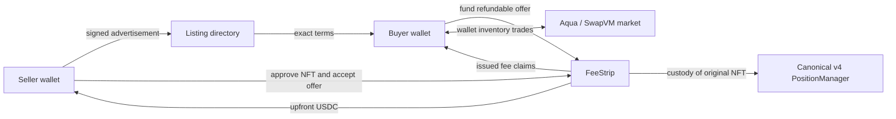
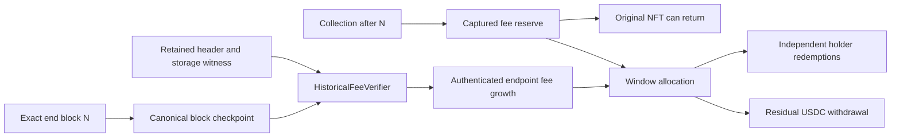

# Architecture

usufruct separates the right to recover an original Uniswap v4 position from transferable claims on that position’s native USDC fees over one agreed earning window. The deployed contracts retain the FeeStrip name. The [economic contract](../feestrip-handoff/PRODUCT_CONTRACT.md) is the specification; this page maps its boundaries to the implementation.

## From signed terms to an instrument



The listing directory stores signed advertisements, not custody or payment. Publication and withdrawal use typed signatures; a listing can become stale if ownership or position terms change. A buyer’s `fundOffer` escrows USDC onchain. The buyer can cancel an unaccepted offer; listing withdrawal or expiry does not itself refund it. The seller’s NFT approval is separate from `acceptOffer`, which validates exact funded terms and the position commitment before activation. See [listing service](../packages/listings/src/service.mjs), [FeeStrip](../contracts/src/FeeStrip.sol) and [wallet adapter](../apps/web/src/chainAdapter.ts).

An eligible position is a supported, nonempty, hookless canonical v4 NFT with native USDC as one currency. Acceptance clears prior fees to the seller, freezes liquidity and range, records a USDC fee-growth baseline and fixes end block **N**. It escrows that same NFT and issues the fixed original quantity **Q** of [FeeClaim](../contracts/src/FeeClaim.sol) tokens. The buyer receives the agreed portion; the seller retains the remainder. No new LP position substitutes for the original.

## Claims and market inventory

Every claim carries its share of the whole window’s unpaid USDC income, including accrual before a secondary purchase. Original Q remains the denominator after transfers and burns:

```text
holder payout = floor(allocated window USDC × redeemed claim quantity / original Q)
```

Claim amounts use 18 decimal places; USDC amounts use six. Each redemption rounds down to a USDC base unit; resulting dust remains segregated rather than becoming a residual-owner windfall. Current ERC20 supply is never substituted for original Q. Other-currency fees are not converted into USDC and belong to the residual right.

[FeeStripMarket](../contracts/src/market/FeeStripMarket.sol) builds the known SwapVM program; [FeeStripRouter](../contracts/src/market/FeeStripRouter.sol) executes bounded ask and bid trades. Makers retain real inventory in their wallets and publish Aqua strategies. Advertised virtual balances are not additional assets: quotes sharing inventory cannot have their capacities added together. The adapter verifies program/runtime identity, current series state, approvals, inventory and deadlines. Maker docking cancels a strategy without withdrawing the series’ fee reserve.

## Capture, return and allocation are separate



`capture` may run at a later block **M > N**, collecting both in-window and later fees. Captured USDC is therefore not automatically the holder allocation. Once collection succeeds, the residual owner can `withdrawNFT` even while proof allocation is pending. A holder does not need the seller or another holder to redeem once allocation is available.

[HistoricalFeeVerifier](../contracts/src/proof/HistoricalFeeVerifier.sol) authenticates a header against [BlockHashCheckpoints](../contracts/src/proof/BlockHashCheckpoints.sol), then verifies account/storage proofs against its state root. The proven native fee-growth endpoint, frozen liquidity and activation baseline determine the window allocation. The original core position is identified through the canonical PositionManager and NFT-derived salt. A verified cache of that exact endpoint can also supply the result. Neither an API amount nor a Graph estimate can allocate funds.

Checkpoint preservation is time-sensitive: Ethereum’s `BLOCKHASH` interface exposes a recent block only within its 256-block window. The [keeper](../packages/keeper/src) and [retention service](../packages/settlement/src) preserve the checkpoint and authenticated proof material. RPC, archive, storage and service availability remain operational dependencies. Retained bytes, digest labels and API cache flags are not settlement authority; contract verification and simulation still apply. Multiple files on one filesystem are not independent hosts.

After allocation, post-window USDC belongs to the residual owner; other-currency proceeds are separately recoverable after capture. Per-series accounting isolates these reserves from funded offers and unrelated balances. Early `recombine` requires the residual right and all original Q before N and before capture/redemption. There is no unilateral early withdrawal or guaranteed buyback.

## Interface and data boundaries

The React app uses a validated deployment manifest and an injected wallet. Reviews bind an immutable selected signer through refresh, approval, simulation and send. Public mode fails closed on invalid configuration and never falls back to fixtures. Service readiness gates new funding/acceptance; it cannot promise future availability or returns.

The static frontend calls separately hosted listing, operations, recovery and analysis APIs. The Graph Subgraph indexes instrument events; Rust Substreams derives pool/range history. Their [composition layer](../packages/data/src) joins verified common-block identities and exposes coverage, lag and source finality. History helps a buyer assess a position; it does not establish an executable quote, predict income or authorize payment. See [Graph evidence](evidence/graph-service.md) for the exact verified scope and [quickstart](QUICKSTART.md) for deployment boundaries.
